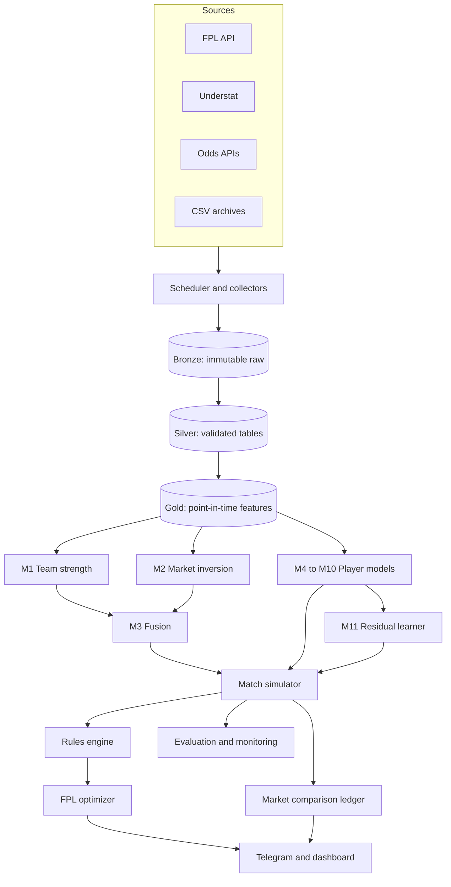
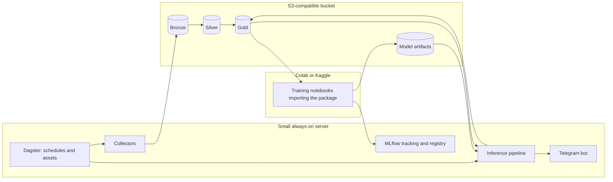

# EPL Betting × FPL Hybrid Forecasting System: Architecture and Design

| | |
|---|---|
| **Version** | 1.0 (draft) |
| **Date** | 29 September 2026 |
| **Status** | Proposed, pre-implementation |
| **Scope** | Data platform, ML models, match simulation, rules engine, decision layer, evaluation, operations |
| **League** | English Premier League. Live from 2026/27; history from 2014/15 |
| **Audience** | The builder (one primary developer) and any collaborator or reviewer |

> Implementation status, spec gaps found during planning, and the phased ticket list live in
> [`docs/IMPLEMENTATION_PLAN.md`](docs/IMPLEMENTATION_PLAN.md).

---

## Contents

1. [Executive summary](#1-executive-summary)
2. [Goals, non-goals and constraints](#2-goals-non-goals-and-constraints)
3. [Design principles](#3-design-principles)
4. [System overview](#4-system-overview)
5. [Data sources and domain rules](#5-data-sources-and-domain-rules)
6. [Data platform](#6-data-platform)
7. [Modeling architecture](#7-modeling-architecture)
8. [Match simulation engine](#8-match-simulation-engine)
9. [Rules engine](#9-rules-engine)
10. [Decision layer](#10-decision-layer)
11. [Training, validation and evaluation](#11-training-validation-and-evaluation)
12. [Technical architecture and operations](#12-technical-architecture-and-operations)
13. [Delivery roadmap](#13-delivery-roadmap)
14. [Risks and mitigations](#14-risks-and-mitigations)
15. [Open questions](#15-open-questions)
- [Appendix A: Notation](#appendix-a-notation)
- [Appendix B: References](#appendix-b-references)

---

## 1. Executive summary

This document specifies a system that produces **calibrated probabilistic forecasts** for English Premier League (EPL) matches and players, and turns them into two outputs:

1. **Fantasy Premier League (FPL) decisions**: transfers, starting XI, captaincy and chip timing over a multi-gameweek horizon.
2. **A market comparison ledger**: a paper-traded comparison against betting prices, used as the most demanding available benchmark of forecast quality. No real money is involved.

The architecture is a **market-anchored hierarchical generative model**:

- **Team level.** Pre-match scoring strength comes from fusing a dynamic, lineup-aware team-strength model with scoring rates implied by de-vigged betting odds.
- **Match level.** A minute-by-minute, state-dependent simulator turns those rates into joint distributions of every relevant match event: shots, goals, assists, minutes, substitutions, defensive actions, saves, cards and bonus. It models game-state effects (leading teams slow down, trailing teams push), red cards, and match-level randomness explicitly.
- **Points level.** A rules engine maps simulated events to FPL points through a versioned per-season config, so scoring-rule changes never require retraining.
- **Decision level.** A multi-gameweek mixed-integer program (MILP) selects the squad from simulated point distributions.

Everything is evaluated **walk-forward**, meaning the model only ever sees data that was available before each historical deadline. It is measured against three external yardsticks:

- de-vigged **closing odds** (match level);
- FPL's own pre-deadline **expected points** and the open-source **OpenFPL** method (player level);
- **season replays** of the full decision pipeline (decision level).

The system runs on one small always-on server plus S3-compatible object storage, with model training on Colab or Kaggle.

---

## 2. Goals, non-goals and constraints

### 2.1 Goals and success criteria

| ID | Goal | Primary metrics | Target |
|---|---|---|---|
| G1 | Calibrated match probabilities | 1X2 log loss, RPS, scoreline-grid log loss, all compared with de-vigged closing odds | Statistically indistinguishable from the closing line; a significant improvement is a stretch goal |
| G2 | Accurate player forecasts | MAE, within-position Spearman ρ, CRPS of the points distribution | Beat FPL `ep_next` (captured before the deadline); match or beat OpenFPL on high-return players |
| G3 | Better FPL decisions | Season-replay total points | Beat the strongest baseline strategy, with a bootstrap CI excluding zero |
| G4 | Calibration everywhere | ECE, reliability curves, PIT uniformity | ECE ≤ 0.02 on every binary output |
| G5 | Operational reliability | Snapshot capture rate; publish time | ≥ 99% of scheduled snapshots captured; predictions published by deadline − 2 h |

### 2.2 Non-goals (v1)

- **Real-money betting.** The operator is based in India. The Promotion and Regulation of Online Gaming Act, 2025 prohibits real-money online games, including betting and paid fantasy contests, and its implementing rules took effect on 1 May 2026. The betting component is therefore strictly a forecasting benchmark and paper ledger. FPL is free to play and unaffected.
- In-play trading.
- Leagues other than the EPL. Championship data is used only as a prior for promoted teams.
- Optical tracking data.

### 2.3 Constraints

- **Budget:** a few USD per month for infrastructure, plus free or low-cost data tiers.
- **Compute:** Colab or Kaggle for training; a small CPU server for scheduled jobs and inference.
- **Data access:** public endpoints only, respecting terms of service, `robots.txt` and rate limits.
- **People:** one primary developer. Components must be buildable and testable independently.

---

## 3. Design principles

**P1. Model events, not points.** FPL points are a deterministic function of match events under season-specific rules. Models predict events; the rules engine computes points. When the rules change (defensive contributions arrived in 2025/26; the Bonus Points System changed for 2026/27), only the config changes.

**P2. The market is the prior.** De-vigged odds aggregate information that no public dataset contains: injuries, likely lineups, weather, and informed money. Models correct the market; they don't ignore it.

**P3. Coherence by construction.** Player goals sum to team goals; clean sheets agree with scorelines; minutes obey substitution limits. These properties are guaranteed because everything comes from one joint generative process, not from reconciling independent predictions afterwards.

**P4. Point-in-time correctness.** Every fact records when it happened *and* when it became knowable. Every feature is computed only from what was knowable at the prediction deadline. Leakage is prevented by the structure of the data platform, not by developer discipline.

**P5. A backtest is a replay of live.** Live predictions and historical backtests run the same code; only the clock differs. This is what makes backtest results predictive of live performance.

**P6. Uncertainty is first-class.** Both parameter uncertainty (epistemic) and outcome randomness (aleatoric) propagate through to decisions. Distributions, not point estimates, cross component boundaries.

**P7. Distributional choices are experiments.** Poisson versus negative binomial versus Conway-Maxwell-Poisson, with or without game state, are hypotheses tested on walk-forward folds, not assumptions baked in.

---

## 4. System overview



The system has four planes:

| Plane | Responsibility | Sections |
|---|---|---|
| Data | Collect, store, validate and serve point-in-time data | 5, 6 |
| Model | Estimate team, match and player processes; simulate matches | 7, 8 |
| Decision | Convert events to points; choose FPL actions; compare with markets | 9, 10 |
| Operations | Scheduling, reproducibility, testing, monitoring | 11, 12 |

---

## 5. Data sources and domain rules

### 5.1 Why the EPL

The EPL is the only league where all of the following are available for free at the same time:

- an official fantasy API with per-player, per-match Opta-derived statistics, including xG, xA and defensive-action counts;
- shot-level xG back to 2014/15 (Understat);
- historical odds from many bookmakers, including Pinnacle and closing prices, going back decades (football-data.co.uk);
- the deepest betting markets, including player props;
- a published, reproducible open-source FPL benchmark (OpenFPL).

**Caveat:** the league with the most data also has the most efficient betting market. Beating the EPL closing line is extremely hard, so G1 is phrased as matching it, not beating it.

### 5.2 Source catalogue

| Source | Content | Grain | History | Cadence | Caveats |
|---|---|---|---|---|---|
| FPL `bootstrap-static` | Price, status, `chance_of_playing_*`, `news`, ownership, transfers, `ep_next` | Player × snapshot | Current state only | Every 3 h; hourly on deadline day | History exists only if you snapshot it yourself |
| FPL `element-summary/{id}` | Per-fixture minutes, goals, assists, xG, xA, xGC, BPS, bonus, saves, defensive-action components | Player × fixture | Current season | After lockdown | In 2026/27, scores finalise at 09:00 UK time the day after a gameweek's last match |
| FPL `fixtures`, `event/{gw}/live` | Kickoffs, fixture difficulty, match stats; live player stats | Fixture; player × fixture | Current season | Daily; live | Kickoff times move, creating blank and double gameweeks |
| vaastav/Fantasy-Premier-League | Merged gameweek history | Player × gameweek | 2016/17 onward | Weekly updates stopped after 2024/25; now three updates per season | `xP` may contain post-match information (leakage) |
| Understat | Shots (x, y, minute, xG, situation, assister); match xG, PPDA | Shot; team-match; player-match | 2014/15 onward | Daily | Its own player IDs; mapping required |
| football-data.co.uk | Results, shots, shots on target, corners, cards, referee; 1X2, over/under 2.5 and Asian handicap odds, including Pinnacle and closing prices | Match | EPL from 1993; Championship (E1) too | Weekly | Team-name normalisation |
| The Odds API | Live 1X2, totals, handicaps; player props via the event-odds endpoint | Fixture × bookmaker × snapshot | Historical from mid-2020 (paid) | Every 6 h, then every 30 min near kickoff | Free tier is 500 credits/month; each call costs markets × regions |
| Pinnacle resellers (e.g. pinnapi) | Sharp prices | Fixture × snapshot | From your first capture | Budget-limited | Pinnacle closed its public API in July 2025 |
| FBref basic match reports | Lineups; event timelines (cards, substitutions) | Match | Long | Post-match | Advanced Opta statistics were removed in January 2026 |
| Club Elo | Daily Elo ratings | Team × day | Long | Daily | Baseline and sanity checks only |

### 5.3 Known data hazards

1. **Leakage through expected-points columns.** Historical `xP` / `ep_this` values may have been scraped after matches. Never use them unshifted; use only the system's own pre-deadline captures of `ep_next`.
2. **Irrecoverable snapshots.** Ownership, prices, injury flags and news text exist only as current state. Any hour without a snapshot is permanently lost. The collector must run before anything else is built.
3. **Provisional versus final statistics.** Bonus and defensive-action counts can change after the final whistle. Pull post-gameweek data only after lockdown.
4. **Identity drift.** FPL player IDs reset every season, Understat IDs are stable, and names vary (accents, nicknames, transliterations). A single `player_uid` crosswalk resolves this (§6.4).
5. **Schedule volatility.** Postponements create blank and double gameweeks. The fixture table is re-read daily, and every downstream artifact is keyed on the fixture, never on the gameweek alone.
6. **Provider churn.** FBref lost its advanced statistics in January 2026; Pinnacle's public API closed in July 2025. Every source sits behind an adapter interface so it can be swapped without touching downstream code.

### 5.4 Scoring rules as data

Each season's scoring rules live in a versioned YAML file. Values must be checked against the official FPL rules page at the start of each season; the golden test suite (§9) is the final arbiter, because it requires reproducing official points exactly.

```yaml
# configs/rules/fpl_2026_27.yaml  (structure; verify every value against official rules)
season: "2026/27"
appearance:        {lt_60: 1, gte_60: 2}
goal:              {GK: VERIFY, DEF: 6, MID: 5, FWD: 4}
assist:            3
clean_sheet:       {GK: 4, DEF: 4, MID: 1, FWD: 0, min_minutes: 60}
goals_conceded:    {GK: {per: 2, points: -1}, DEF: {per: 2, points: -1}}   # only while on pitch
saves:             {per: 3, points: 1}
penalty_save:      5
penalty_miss:      -2
yellow_card:       -1
red_card:          -3
own_goal:          -2
defensive_contribution:
  DEF:     {actions: [clearance, block, interception, tackle], threshold: 10, points: 2}
  MID_FWD: {actions: [clearance, block, interception, tackle, recovery], threshold: 12, points: 2}
  cap_per_match: 2
bonus:             {ranks: [3, 2, 1], tie_rule: official}
bps_changes_2026_27:
  tackled_penalty: 0            # previously -1 per time tackled
  cbi: {per: 3, bps: 1}         # previously 1 BPS per 2 CBI
  gk_save_inside_box: 3
  gk_save_other: 2              # replaces "outside the box" = 2
  gk_big_chance_saved: 1
  penalty_save: 8               # 7 + 1 for big chance saved
game:
  squad: {GK: 2, DEF: 5, MID: 5, FWD: 3}
  max_per_club: 3
  free_transfer_bank_max: 5
  hit_cost: 4
  chips: {sets: 2, per_set: [wildcard, free_hit, triple_captain, bench_boost], first_set_deadline_gw: 19}
  lockdown: "D+1 09:00 Europe/London"
```

---

## 6. Data platform

### 6.1 Storage layers

| Layer | Format | Content | Mutability |
|---|---|---|---|
| **Bronze** | Gzipped JSON/CSV, byte-for-byte as received, plus request metadata | Every API response and file download | Append-only; never edited |
| **Silver** | Typed Parquet tables | Normalised, validated, entity-resolved facts | Fully rebuildable from bronze |
| **Gold** | Parquet | Feature spine, feature families, predictions, decisions, evaluation results | Rebuildable from silver plus model artifacts |

Path conventions (S3-compatible bucket):

```
bronze/source=fpl/endpoint=bootstrap-static/dt=2026-09-29/obs=2026-09-29T06:00:02Z.json.gz
bronze/source=odds_api/market=h2h_totals/dt=2026-09-29/obs=2026-09-29T12:00:05Z.json.gz
silver/snap_fpl_player/season=2026-27/dt=2026-09-29/part-000.parquet
gold/pred_player/run_id=2026-10-02T16-30Z_ab12cd/part-000.parquet
```

Every bronze object carries `source`, `endpoint`, request parameters, HTTP status, `observed_at` (UTC, collector clock) and a content hash.

### 6.2 Bitemporal model and information sets

Each fact $f$ carries two timestamps:

- $e_f$, the **event time**: when it happened in the world (for example, a match kickoff);
- $o_f$, the **observation time**: when the system could first have known it.

For polled sources, $o_f$ is the collector's fetch time. For sources the system backfills (historical CSVs, Understat history), $o_f = e_f + \ell_s$, where $\ell_s$ is a conservative publication lag for source $s$ configured in `sources.yaml` (for example, 24 h for Understat match data).

The **information set** at a prediction deadline $D$ is

$$\mathcal I(D) = \{\, f : o_f \le D \,\}.$$

A feature $X$ for player $p$ and fixture $m$, predicted at deadline $D$, is **admissible** if and only if $X = \varphi(\mathcal I(D))$ for some function $\varphi$. Three mechanisms enforce this:

1. Feature builders receive a DuckDB view already filtered to $o_f \le D$; they cannot see anything later.
2. Each prediction run records $\max o_f$ over all facts used, and CI asserts that it is $\le D$.
3. A "future shuffle" test permutes all rows with $o_f > D$; features must be unchanged.

### 6.3 Core schema

| Table | Grain | Key columns |
|---|---|---|
| `dim_player` | One row per real person | `player_uid`, `fpl_id` per season, `understat_id`, name variants, date of birth, position history |
| `dim_team` | Team | `team_uid`, source IDs, name variants |
| `dim_fixture` | Fixture | `fixture_uid`, season, gameweek, kickoff, home and away `team_uid`, source IDs |
| `snap_fpl_player` | Player × snapshot | price, status, `chance_of_playing_next_round`, news, ownership, transfers in/out, `ep_next`, `observed_at` |
| `fact_player_match` | Player × fixture | minutes, start flag, goals, assists, xG, xA, shots, key passes, defensive-action components, saves, cards, BPS, bonus, points |
| `fact_shot` | Shot | fixture, minute, team, shooter, assister, x, y, xG, situation, body part, outcome |
| `fact_match_event` | Event | fixture, minute, type (goal, red card, substitution, penalty), team, players |
| `snap_odds` | Fixture × bookmaker × market × outcome × snapshot | price, line, `observed_at`, `is_closing` |
| `pred_run` | One inference run | `run_id`, deadline, git SHA, data-manifest hash, config hash, model versions, seeds |
| `pred_player` | Run × player × fixture | points distribution summary (mean, quantiles, P(≥ k)), event-level expectations |
| `pred_fixture` | Run × fixture | fused rates, 1X2, totals, BTTS, scoreline grid |
| `decision` | Run × gameweek | squad, XI, captain, transfers, chip, expected points, solver gap |

### 6.4 Entity resolution

Algorithm for linking a source record to `player_uid`:

1. **Candidate generation.** Restrict to players registered to the same club on the match date with a compatible position.
2. **Similarity.** $s = \max_{v}\ \text{token\_set\_ratio}(\text{norm}(n_{\text{src}}), \text{norm}(v))$ over all known name variants $v$, where `norm` strips accents, punctuation and case (using `rapidfuzz`).
3. **Decision.** $s \ge 92$: link automatically. $80 \le s < 92$: send to a review queue. $s < 80$: create a new entity.
4. **Overrides.** `entities/overrides.yaml` is applied last and always wins.
5. **Coverage gate.** At least 99.5% of minutes played must belong to mapped players, or the pipeline stops.

### 6.5 Feature spine and as-of joins

The feature spine has one row per (`player_uid`, `fixture_uid`, `deadline_at`, horizon $h$). Every feature family joins to it the same way, with an as-of join that takes the latest fact observed at or before the deadline:

```sql
SELECT f.player_uid, f.fixture_uid, f.horizon,
       s.price, s.chance_of_playing_next_round, s.news
FROM feature_spine AS f
ASOF JOIN snap_fpl_player AS s
  ON  f.player_uid  = s.player_uid
  AND f.deadline_at >= s.observed_at;
```

For horizons $h > 1$, market features are usually missing. Models treat missing prices as "no market information" (§7.5) rather than imputing them.

### 6.6 Data contracts and quality gates

Every silver build runs the following checks. Any failure blocks downstream jobs and sends an alert.

- **Schema contracts** (`pandera`): column types, allowed ranges, non-null keys.
- **Conservation:** per team-match, the sum of player goals equals team goals minus opponent own goals; at most 11 players on the pitch at any minute; minutes per player ≤ match length including stoppage time.
- **Cross-source agreement:** FPL goals versus Understat goals per match; any mismatch is flagged.
- **Freshness:** the latest `observed_at` per source must fall within its expected cadence.
- **Coverage:** the entity-resolution gate (§6.4); every scheduled fixture has at least one odds snapshot before kickoff.

---

## 7. Modeling architecture

### 7.1 Component inventory

Each component models one real quantity, with its own likelihood and metric. Components are trained and evaluated separately and meet only inside the simulator (§8).

| ID | Component | Target | Model | Likelihood / loss | Primary metric |
|---|---|---|---|---|---|
| M1 | Team strength | Team goals and xG per match | Dynamic state-space ratings, lineup-aware | Poisson (goals) + Gamma (xG) | Scoreline log loss, RPS |
| M2 | Market inversion | Base rates implied by odds | Emulator-based solver | Squared error to de-vigged prices | Reproduction error |
| M3 | Fusion | Final pre-match base rates | Log-linear pool with time-to-kickoff weights | Scoreline-grid NLL | RPS relative to closing line |
| G | In-match process | Shot and goal timing; red cards | State-dependent piecewise-exponential intensities with match frailty | Poisson (piecewise exponential) | Scoreline grid, draw rate, in-play calibration |
| M4 | Minutes | Start, 60+ minutes, sub appearance; substitution timing | Staged calibrated classifiers + in-simulation hazards | Binary log loss | Brier score, calibration |
| M5 | Attacking rates | Shots/90, xG per shot, xA/90 | Hierarchical Gamma-Poisson and Beta models | Poisson / Beta | Goal and assist log loss |
| M6 | Finishing | Goals given xG | Heavily shrunk multiplicative effect | Poisson | Calibration |
| M7 | Defensive actions | Defensive-action counts | Hierarchical negative binomial GLM by game state | Negative binomial | Brier score on threshold crossing |
| M8 | Goalkeeping | Saves, penalty saves | Shots on target faced × save probability | Binomial | Save-point log loss |
| M9 | Discipline | Yellow and red cards | Player + referee + game-state hazards | Bernoulli | Brier score |
| M10 | Bonus residual | BPS not explained by simulated events | Per-player Gaussian | Squared error | Bonus accuracy |
| M11 | Residual learner | Corrections to M4, M5, M7 parameters | LightGBM, then a multi-task network | NLL of the adjusted distributions | End-to-end ablation gain |
| M12 | Price changes (optional) | Overnight price rise or fall | Classifier on net transfers | Log loss | Precision at threshold |

Notation used throughout: teams $i, j$; team side $k \in \{H, A\}$ with opponent $-k$; player $p$; match $m$; minute $t$; deadline $D$. Appendix A has the full list.

### 7.2 M1: Dynamic team strength

**Pre-match rates.** For match $m$ with home team $i$ and away team $j$ at time $t$:

$$\log \mu^{H}_m = \eta + a_{i,t} - d_{j,t} + \boldsymbol\beta^\top \mathbf z^{H}_m, \qquad \log \mu^{A}_m = a_{j,t} - d_{i,t} + \boldsymbol\beta^\top \mathbf z^{A}_m$$

- $a$ is attack strength and $d$ defence strength.
- $\eta$ is home advantage.
- $\mathbf z$ holds covariates: days of rest, midweek European fixture, and a recent-manager-change flag.

**State evolution.** Ratings follow a mean-reverting random walk between matches, where $\Delta$ is days elapsed:

$$a_{i,t} = \phi\, a_{i,t^-} + \epsilon^{a}, \quad \epsilon^{a} \sim \mathcal N(0,\ \sigma_a^2 \Delta), \qquad d_{i,t} = \phi\, d_{i,t^-} + \epsilon^{d}, \quad \epsilon^{d} \sim \mathcal N(0,\ \sigma_d^2 \Delta)$$

with sum-to-zero constraints $\sum_i a_{i,t} = \sum_i d_{i,t} = 0$ for identifiability.

**Observations.** Both goals and xG inform the ratings:

$$Y^{k}_m \sim \text{Poisson}(\mu^{k}_m), \qquad X^{k}_m \sim \text{Gamma}\!\left(\kappa,\ \kappa / \mu^{k}_m\right)$$

The Gamma is parameterised so that $\mathbb E[X] = \mu$ and $\text{Var}(X) = \mu^2/\kappa$. The log-likelihood weights the two signals:

$$\ell = \sum_{m,k} \Big[\log p(Y^{k}_m \mid \mu^{k}_m) + \omega \log p(X^{k}_m \mid \mu^{k}_m)\Big]$$

$\omega$ is tuned on walk-forward folds (ablation G-series, §11.7). xG is less noisy than goals; goals are what actually happened.

**Season transitions.** Over each summer, ratings regress toward the mean and shift with squad changes:

$$a_{i}^{\text{new}} = \kappa_s\, a_{i}^{\text{old}} + \gamma_a\, \Delta v_i$$

where $\kappa_s \in (0,1)$ is a regression factor and $\Delta v_i$ is the change in log squad market value. The same form applies to $d$.

**Promoted teams.** A promoted team's starting ratings are drawn from its Championship ratings translated to EPL scale:

$$a_i^{\text{EPL}} \sim \mathcal N\!\left(\psi_a + s_a\, a_i^{\text{E1}},\ \tau_a^2\right)$$

$(\psi_a, s_a, \tau_a)$ are estimated from the first-season performance of historical promoted teams. The same applies to $d$.

**Lineup awareness.** Ratings describe a team's typical lineup. When a key player is out, the effective rating shifts:

$$a^{\text{eff}}_{i,m} = a_{i,t} + \sum_{p \in \mathcal S_i} \big(s_{p,m} - \bar s_p\big)\, \iota_p$$

- $s_{p,m} \in \{0,1\}$ is whether player $p$ starts, sampled per simulation from M4.
- $\bar s_p$ is the player's trailing start rate.
- $\iota_p$ is the player's attacking impact relative to a replacement, approximated by $\iota_p \approx \log\!\big(1 + (x_p - x^{\text{repl}}_{\text{pos}})/X_i\big)$, where $x_p$ is the player's npxG + xA per 90 and $X_i$ is the team's per-90 total.

A defensive analogue applies to $d$. This first-order approximation is replaced by an estimated impact model if ablation shows it matters (A-series).

**Fitting.** NumPyro with NUTS and a non-centred parameterisation for backtests. For weekly live updates, a filtering step (Laplace or extended Kalman approximation) updates ratings between full refits every four gameweeks.

**Forecast horizon.** For horizon $h$, ratings are drawn from the forecast distribution rather than fixed at today's estimate:

$$a_{t+h} \mid a_t \sim \mathcal N\!\Big(\phi^{h} a_t,\ \sigma_a^2 \sum_{r=1}^{h} \phi^{2(h-r)} \Delta_r\Big)$$

so uncertainty grows with distance. This stops the optimizer from being overconfident about fixtures six weeks away.

### 7.3 M2: Market inversion

**Removing the margin.** For decimal odds $o_k$ on mutually exclusive outcomes $k$, the raw implied probabilities are $\pi_k = 1/o_k$ and the overround is $S = \sum_k \pi_k > 1$. Three de-vig methods are implemented; the default is chosen by calibration on historical closing prices.

| Method | Formula | Note |
|---|---|---|
| Multiplicative | $p_k = \pi_k / S$ | Simplest; ignores favourite–longshot bias |
| Power | $p_k = \pi_k^{c}$, with $c$ solving $\sum_k \pi_k^{c} = 1$ | Shades longshots more |
| Shin | $p_k = \dfrac{\sqrt{z^2 + 4(1-z)\,\pi_k^2/S} - z}{2(1-z)}$, with $z$ solving $\sum_k p_k = 1$ | Models informed trading; usually best on 1X2 |

**Inversion through the simulator.** With game-state effects (§7.5), the mapping from base rates to final-score probabilities has no closed form. The inversion therefore solves

$$(\hat{\bar\lambda}_H, \hat{\bar\lambda}_A) = \arg\min_{\bar\lambda_H, \bar\lambda_A} \sum_{k \in \mathcal K} w_k \Big(P^{\text{sim}}_k(\bar\lambda_H, \bar\lambda_A) - p^{\text{mkt}}_k\Big)^2$$

over markets $\mathcal K = \{H, D, A, \text{Over 2.5}\}$, plus Asian handicap lines and BTTS when available.

Because $P^{\text{sim}}$ is a Monte Carlo quantity, it is replaced by an **emulator**:

1. Precompute simulator outputs on a grid, e.g. $60 \times 60$ points over $[0.2, 4.0]^2$, with $10^5$ simulations per grid point.
2. Fit a smooth surrogate per market (bicubic spline, or a small MLP if features beyond the two rates are added).
3. Solve with L-BFGS-B.

The emulator is refit whenever the in-match process (§7.5) is retrained. For the closed-form benchmark models (G0–G3), $P$ is computed analytically.

**Player props (Phase 5).** Anytime-scorer prices are one-way markets, so they are de-vigged using an estimated margin and used as player-level priors on scoring probability, fused like M3.

### 7.4 M3: Fusion

$$\log \bar\lambda_k = w(\tau)\,\log \bar\lambda^{\text{mkt}}_k + \big(1 - w(\tau)\big)\log \bar\lambda^{\text{mod}}_k + b_k, \qquad w(\tau) = \sigma\!\big(\alpha_0 + \alpha_1 \log(1+\tau) + \alpha_2\, \text{liq}\big)$$

- $\tau$ is hours between the price snapshot and kickoff.
- $\text{liq}$ is a liquidity proxy: number of bookmakers quoting and the overround.
- $\sigma$ is the logistic function.
- When no market price exists (typically $h > 1$), $w = 0$.

Parameters $(\alpha, b)$ are fit by minimising scoreline-grid negative log-likelihood over historical fixtures, using the price snapshot available at each deadline, with ridge regularisation. The fused rates are evaluated against both outcomes and closing-line probabilities. A large fitted $w$ is expected and is not a failure: the model's job is to add information at the margin.

### 7.5 G: In-match goal process

**Why.** Three empirical regularities break the "draw a scoreline from independent Poissons" approach:

- Draws occur roughly 10% more often than independent Poisson models predict.
- Trailing teams score at elevated rates, and scoring rates rise through a match. Red cards cut the penalised team's scoring intensity substantially.
- Much apparent overdispersion comes from mixing teams of different strength. Once team strength is conditioned on, EPL goals can even be **underdispersed**. A negative binomial, which can only add variance, may therefore be the wrong fix.

The in-match process lets the data decide the direction of dispersion.

**Intensity.** The shot intensity for side $k$ at minute $t$ is

$$\lambda^{S}_k(t) = \frac{\bar\lambda^{S}_k}{90}\; g(t)\; \exp\!\Big(\beta_{\text{st}}\big(\Delta_k(t), b(t)\big) + \beta^{\text{own}}_{\text{rc}} R_k(t) + \beta^{\text{opp}}_{\text{rc}} R_{-k}(t) + \beta_{\text{ht}}\,\mathbb 1[t > 45]\Big)\; \varepsilon_m$$

- $\bar\lambda^{S}_k$ is the base shot rate per 90 in a level, eleven-versus-eleven state. It is tied to the fused goal rate via team conversion; the emulator (§7.3) handles the exact mapping.
- $g(t)$ is a time profile with mean 1 over regulation time, piecewise constant with a random-walk prior.
- $\Delta_k(t)$ is goal difference from side $k$'s perspective, clipped to $\{-2, \dots, +2\}$. $b(t)$ is a time bucket: 0–30, 30–60, 60–75, 75–end.
- $R_k(t)$ is the number of red cards shown to side $k$.
- $\varepsilon_m \sim \text{LogNormal}(-\sigma_\varepsilon^2/2,\ \sigma_\varepsilon^2)$ is a match-level frailty shared by both teams, with $\mathbb E[\varepsilon_m] = 1$. It represents unobserved conditions (pitch, weather, an open game) and induces positive correlation between the two teams' output.

Each shot's xG is drawn from the shooter's distribution (M5), and the shot is scored with probability $\text{xG} \times f_p$ (M6). Penalties and own goals are separate low-rate processes (§7.7).

**Game-state effects are hierarchical:**

$$\beta_{\text{st}}(\Delta, b) = \beta^{\text{league}}(\Delta, b) + \beta^{\text{team}}_{i}(\Delta), \qquad \beta^{\text{team}}_{i}(\Delta) \sim \mathcal N(0, \tau_{\text{st}}^2)$$

so managers who shut games down harder than average can be learned, with shrinkage.

**Red cards** follow their own hazard, which also depends on game state:

$$h^{R}_k(t) = \bar h_R\, g_R(t)\, \exp\!\big(\gamma_R\, \Delta_k(t)\big)$$

**Stoppage time** extends each half by $U_1, U_2$ drawn from an empirical distribution conditional on the number of goals, substitutions and cards in that half.

**Estimation (piecewise exponential).** Each match is split into bins of width $\delta = 5$ minutes, plus stoppage bins, and bins are split further wherever the state changes. In bin $b$ for side $k$ of match $m$, with exposure $E_{mkb}$ (minutes) and count $N_{mkb}$:

$$N_{mkb} \sim \text{Poisson}\big(E_{mkb}\; \lambda_{mkb}\big)$$

This is a Poisson GLM with offset $\log E_{mkb}$, fitted hierarchically in NumPyro. Shots (G6) supply roughly ten times more events than goals and respond to game state in the same direction, which makes the state effects much better determined.

**Dispersion.** Frailty adds variance. For a count with conditional mean $\mu$ and log-normal mixing,

$$\text{Var}(N) = \mu + \mu^2\left(e^{\sigma_\varepsilon^2} - 1\right).$$

Game-state damping (leaders slowing, trailers pushing) pulls results toward draws and trims blowouts, which reduces the variance of goal difference. The fitted parameters decide which effect dominates. If $\sigma_\varepsilon$ fits near zero, frailty is dropped.

**Closed-form benchmarks.** The process model must beat these (§11.7):

| Model | Joint pmf |
|---|---|
| Independent Poisson (G0) | $P(x,y) = \text{Pois}(x;\lambda)\,\text{Pois}(y;\mu)$ |
| Dixon-Coles (G1) | $P(x,y) = \tau_{\lambda,\mu}(x,y)\,\text{Pois}(x;\lambda)\,\text{Pois}(y;\mu)$, with $\tau(0,0) = 1 - \lambda\mu\rho$, $\tau(0,1) = 1 + \lambda\rho$, $\tau(1,0) = 1 + \mu\rho$, $\tau(1,1) = 1 - \rho$, and $\tau = 1$ otherwise |
| Bivariate Poisson, diagonal-inflated (G2) | $X = W_1 + W_3$, $Y = W_2 + W_3$ with $W_r \sim \text{Pois}(\lambda_r)$; then $P = (1-\pi)\,\text{BP}(x,y) + \pi\, q(x)\,\mathbb 1[x = y]$ |
| Conway-Maxwell-Poisson marginals (G3) | $P(Y = y) = \dfrac{\lambda^{y}}{(y!)^{\nu}\, Z(\lambda,\nu)}$; $\nu > 1$ underdispersed, $\nu < 1$ overdispersed |

### 7.6 M4: Minutes and availability

**Pre-match stages.** Three calibrated classifiers:

- $\pi^{S}_p = P(\text{start})$
- $\pi^{60}_p = P(\text{minutes} \ge 60 \mid \text{start})$
- $\pi^{B}_p = P(\text{sub appearance} \mid \text{not started})$

**Features:** starts in the last 3/5/10 matches; minutes trend; days since last match and to the next one; European fixtures either side; FPL `status` and `chance_of_playing_next_round`; keyword flags from `news` (injury type, "late fitness test", suspension); the manager's historical rotation rate; depth at the player's position (number of fit alternatives and their start rates); recent transfer arrivals in that position.

**Model:** LightGBM with monotone constraints (for example, $\pi^{S}$ is non-decreasing in `chance_of_playing`), followed by isotonic calibration. For players with few appearances $n_p$, blend with a position × price prior:

$$\tilde\pi_p = w_p\, \pi^{\text{GBM}}_p + (1 - w_p)\, \pi^{\text{prior}}_{\text{pos,price}}, \qquad w_p = \frac{n_p}{n_p + k}$$

**In-simulation substitutions.** Given a start, minutes come from a per-minute substitution hazard that depends on game state:

$$h^{\text{off}}_p(t) = \sigma\!\Big(\theta_{\text{role}(p)} + f(t) + \gamma_{\text{role}(p)}\, \Delta_k(t) + \nu_p\Big)$$

For example, attackers are withdrawn earlier in comfortable leads and defensive players are brought on. Replacements are drawn from the bench in proportion to $\pi^{B}_q$ times role compatibility, subject to the substitution limit. A small constant hazard represents injury substitutions.

**Horizon drift.** For future gameweeks, start probability decays toward the player's long-run rate $\bar\pi^{S}_p$:

$$\pi^{S}_{p,h} = \omega^{h-1}\pi^{S}_{p,1} + \big(1 - \omega^{h-1}\big)\,\bar\pi^{S}_p$$

Minutes errors are the largest source of FPL forecast error, so this component receives disproportionate engineering effort.

### 7.7 M5 and M6: Attacking rates, finishing and allocation

**Shot rate with explicit shrinkage.** Let $S_{p,m}$ be player $p$'s shots in match $m$ and $u_{p,m} = (\text{minutes}_{p,m}/90)\cdot c_{i,m}$ the exposure, where $c_{i,m}$ is the team's expected shot volume relative to league average. With the prior $r_p \sim \text{Gamma}(\alpha_g, \alpha_g/\mu_g)$ for group $g$ (position × team-role cluster) and time-decay weights $w_m = 2^{-\text{age}_m/h_{1/2}}$, the posterior is conjugate:

$$r_p \mid \text{data} \sim \text{Gamma}\!\Big(\alpha_g + \sum_m w_m S_{p,m},\ \ \frac{\alpha_g}{\mu_g} + \sum_m w_m u_{p,m}\Big), \qquad \mathbb E[r_p] = \frac{\alpha_g + \sum_m w_m S_{p,m}}{\alpha_g/\mu_g + \sum_m w_m u_{p,m}}$$

With little data, the estimate stays near the group mean $\mu_g$; with lots of data, it approaches the player's own rate. $\alpha_g$ controls how quickly evidence overrides the prior.

**Shot quality.** Mean xG per shot $\bar q_p \sim \text{Beta}$ with a hierarchical prior by position and role.

**Finishing (M6).** Goals given xG follow $G_p \sim \text{Poisson}(f_p \cdot \text{XG}_p)$ with $\log f_p \sim \mathcal N(0, \tau_f^2)$ and a small $\tau_f$. Finishing skill is real but weak and needs years of data to detect, so most players stay close to $f_p = 1$.

**Assists.** A per-90 xA rate $a_p$ uses the same Gamma-Poisson structure.

**Transfers into the EPL.** Rates observed in another Understat league are translated: $r^{\text{prior}}_p = r^{\text{src}}_p \cdot s_{\text{src}\to\text{EPL}}$, with translation factors estimated from past movers.

**Penalties and own goals.** Each team has a penalty-award hazard (with a small game-state effect). The taker is chosen from a configured hierarchy updated from news, and conversion follows a Beta prior at the league rate, updated per taker. Own goals are a small constant-rate process credited to the opponent.

**Allocation inside the simulation.** Team-level intensities from §7.5 give *when* side $k$ shoots. Players only split that total, which guarantees coherence (P3). For a non-penalty shot at minute $t$, with $\mathcal O_k(t)$ the set of side $k$'s players on the pitch:

$$P(\text{shooter} = p) = \frac{r_p\, \mathbb 1[p \in \mathcal O_k(t)]}{\sum_{q} r_q\, \mathbb 1[q \in \mathcal O_k(t)]}$$

The shot's xG is drawn from the shooter's quality distribution, and it is scored with probability $\text{xG}\cdot f_p$. A goal is assisted with probability $\alpha_k$ (team- and situation-specific), and the assister is chosen in proportion to $a_q$ over $q \in \mathcal O_k(t) \setminus \{p\}$.

### 7.8 M7: Defensive contributions

For each player, the relevant count $C_p$ is clearances + blocks + interceptions + tackles for defenders, plus recoveries for midfielders and forwards. It depends on how long the player spent in each game state $s$ (leading, level, trailing), which the simulator records as $\tau_{p,s}$ minutes:

$$C_p \sim \text{NegBin}(\mu_p, \kappa_C), \qquad \mu_p = \sum_{s} \frac{\tau_{p,s}}{90}\,\rho_{p,s}, \qquad \log \rho_{p,s} = \theta_p + \delta_s + \boldsymbol\gamma^\top \mathbf z_{\text{opp}}$$

- $\theta_p$ has a hierarchical prior by role (centre-back, full-back, defensive midfielder, and so on).
- $\delta_s$ is the game-state effect; teams protecting a lead defend more.
- $\mathbf z_{\text{opp}}$ contains opponent possession and strength proxies.

The FPL outcome depends on crossing a threshold $T$ (10 for defenders, 12 for midfielders and forwards):

$$P(\text{defensive points}) = P(C_p \ge T) = 1 - F_{\text{NB}}(T - 1;\ \mu_p, \kappa_C)$$

Because the reward is a threshold, variance matters as much as the mean. Evaluation uses the Brier score on the threshold event and randomised PIT on the counts. **Data note:** per-match component counts come from the FPL API from 2025/26 onward. Earlier seasons need another source; otherwise train on 2025/26 onward with strong hierarchical priors.

### 7.9 M8 to M10: Goalkeeping, discipline and bonus

**Saves (M8).** The simulator produces shots on target faced (shots × on-target probability). Each on-target shot that isn't scored is a save. Save points are $\lfloor \text{saves}/3 \rfloor$. Penalty saves come from the penalty process.

**Cards (M9).** A per-player yellow-card hazard $\text{logit}\ P = \theta^{Y}_p + \rho_{\text{ref}} + \gamma_Y\,\Delta_k(t) + f_Y(t)$, scaled to per-minute rates. A second yellow becomes a red; straight reds are a small separate hazard. A red card feeds back into §7.5.

**Bonus (M10).** BPS is reconstructed from simulated events using the season's BPS weights $w_e$, plus a residual for components the simulator doesn't generate (passing, key passes, and so on):

$$\text{BPS}_p = \sum_e w_e\, n_{p,e} + \epsilon_p, \qquad \epsilon_p \sim \mathcal N\big(\mu^{\text{res}}_p,\ \sigma^{\text{res}\,2}_p\big)$$

$\mu^{\text{res}}_p$ and $\sigma^{\text{res}}_p$ are fitted on historical official BPS minus reconstructed BPS. Bonus points are assigned by ranking all players in the match within each simulation, applying the official tie rules. This captures the fact that bonus depends on everyone else's performance.

### 7.10 M11: Residual learner

The residual learner corrects parameters of the structured models, never points directly:

$$\tilde\psi_{p,m} = \psi^{\text{base}}_{p,m} + \delta_\phi(\mathbf x_{p,m}), \qquad \psi = \big(\text{logit}\,\pi^{S},\ \text{logit}\,\pi^{60},\ \log r_p,\ \text{logit}\,\bar q_p,\ \log a_p,\ \theta_p\big)$$

**Loss.** The negative log-likelihood of observed outcomes under the *adjusted* distributions, so the learner is judged on the same probabilistic footing as the base models. Tasks are balanced with learned homoscedastic uncertainty weights (Kendall et al., 2018), with an L2 penalty keeping corrections small:

$$\mathcal L(\phi, \boldsymbol\sigma) = \sum_{t \in \text{tasks}} \left(\frac{1}{2\sigma_t^2}\,\mathcal L_t(\phi) + \log \sigma_t\right) + \lambda_\delta\, \mathbb E\,\|\delta_\phi\|^2$$

**Version 1:** one LightGBM model per task, trained on base-model residuals with a custom objective equal to that task's adjusted NLL.

**Version 2:** a shared encoder with task heads.
- Input: the player's last $N = 10$ matches as a sequence of tokens (minutes, shots, xG, xA, defensive actions, touches, position, opponent strength, time in each game state).
- Encoder: a 2-layer GRU or small transformer with hidden size 64.
- Teammate context: a DeepSets encoder $h_{\text{team}} = \rho\big(\sum_{q} \phi(\mathbf x_q)\big)$ over the available squad, to capture role vacuums (for example, the usual penalty taker is out).
- Heads: one per element of $\psi$.

**Promotion rule.** M11 ships only if the full simulator improves end-to-end metrics (G2, G3) on walk-forward folds, with a paired bootstrap CI excluding zero. Improving its own loss is not enough.

### 7.11 M12: Price changes (optional)

A classifier predicts overnight price rises and falls from net transfers normalised by ownership, time since the last change, and deadline proximity. The optimizer uses it to time transfers. Low priority.

### 7.12 Uncertainty propagation

- **Epistemic:** simulations are run in batches, each using a fresh posterior draw of all model parameters (for example, 100 parameter draws × 100 simulations each). New or uncertain players therefore get wider point distributions than established players with the same mean.
- **Aleatoric:** within a batch, match randomness comes from the simulator.
- **Horizon:** team ratings and start probabilities widen with $h$ (§7.2, §7.6).

---

## 8. Match simulation engine

### 8.1 Algorithm

```text
inputs: fixture m, deadline D, parameter draws θ(1..B), sims per draw N
for b in 1..B:                                    # epistemic batch
    for n in 1..N:                                # aleatoric simulation
        ε      ← LogNormal(-σε²/2, σε²)          # match frailty
        XI_k   ← sample starters from M4 π^S (respecting squad and position rules)
        λ̄_k    ← M3 fused rate, adjusted for sampled XI (§7.2 lineup awareness)
        U1, U2 ← stoppage time for each half
        state  ← (score 0-0, reds 0-0, on-pitch sets, subs used 0-0)
        for t in 1 .. 90 + U1 + U2 (1-minute steps):
            for side k in {H, A}:
                shots   ~ Poisson(λ^S_k(t | state) · 1 min)            # §7.5
                for each shot: shooter ∝ r_p on pitch; xG ~ q_p; goal ~ Bernoulli(xG·f_p)
                                on goal: assist? → assister ∝ a_q; update score
                penalty ~ hazard; own goal ~ hazard
                red     ~ h^R_k(t | Δ); update reds
                subs    ~ h^off_p(t | Δ, role) for each on-pitch player; draw replacements
            accumulate per-player: minutes, time in each game state, shots on target faced
        per player: defensive actions ~ NegBin(μ_p(τ_p,s)), cards, saves, BPS residual
        bonus   ← rank BPS within match, official tie rules
        points  ← RulesEngine[season](events)
outputs: per-player point samples; scoreline grid; market-comparable probabilities
```

### 8.2 Implementation

- **Vectorisation.** State is held in arrays of shape (simulations × players) and advanced one minute at a time for all simulations at once in NumPy. About 96 steps × 10 fixtures × 10,000 simulations is well within a few seconds on a CPU.
- **Faster variant (later).** Event-driven simulation by thinning: draw the next event time from exponential clocks with piecewise-constant intensities, jumping between state changes instead of stepping every minute.
- **Common random numbers.** When comparing candidate decisions (captain A versus B), the same random streams are reused so differences reflect the decision, not simulation noise.
- **Double gameweeks** simulate each fixture independently and sum points per player. Blank gameweeks contribute zero.

### 8.3 Monte Carlo error

With $S$ simulations and per-player points standard deviation $s$:

$$\text{SE}(\hat{\mathbb E}[\text{pts}]) = \frac{s}{\sqrt S}, \qquad \text{SE}(\hat P(\text{pts} \ge k)) = \sqrt{\frac{\hat p (1-\hat p)}{S}}$$

With $s \approx 3$ and $S = 10{,}000$, the SE of the mean is about 0.03 points. For a tail event with $p = 0.05$, the SE is about 0.002. Both are far below model error, so $S = 10{,}000$ is sufficient for decisions. The emulator grid (§7.3) uses $10^5$ per point because its errors feed into every inversion.

### 8.4 Outputs

- **Per player:** full sample vectors (retained for the optimizer's scenario mode) plus summaries: mean, quantiles, $P(\text{pts} \ge k)$ for $k \in \{2, 6, 10, 15\}$, and expected minutes, goals, assists, clean-sheet and defensive-point probabilities.
- **Per fixture:** scoreline grid up to 6–6, 1X2, totals, BTTS, Asian handicap, anytime-scorer probabilities.
- **Correlations:** teammate and opponent point covariances, used for captaincy and stacking decisions.

### 8.5 Simulator validation

1. **Market reproduction:** fed emulator-calibrated rates, the simulator reproduces de-vigged 1X2 and over/under within tolerance.
2. **Scoreline grid calibration** against historical frequencies, including draw rate and goal-difference tails.
3. **In-play calibration:** $P(\text{next goal} \mid \text{score}, \text{minute})$ against observed outcomes.
4. **Property tests:** player goals sum to team goals minus opponent own goals; at most 11 on the pitch; substitutions within the limit; minutes within match length; probabilities sum to 1.

---

## 9. Rules engine

The rules engine is a pure, vectorised function

$$\text{points}_{p} = \mathcal R_{\text{season}}\big(\text{events}_p,\ \text{events of all players in the match}\big)$$

driven entirely by the season's YAML config (§5.4). It needs everyone's events because of bonus ranking and clean sheets.

**Golden tests.** For every player-fixture in 2025/26 and every finalised 2026/27 gameweek, feeding the *official* event statistics into $\mathcal R$ must reproduce the *official* `total_points` exactly. Any mismatch fails CI. This is the definitive check that the rules config is correct.

**Edge cases covered by tests:**
- double gameweeks;
- own goals;
- penalty saves and misses;
- substitute appearances;
- clean sheets requiring at least 60 minutes;
- goals conceded counted only while the player is on the pitch;
- the defensive-contribution cap;
- bonus ties;
- position reclassification between seasons.

---

## 10. Decision layer

### 10.1 FPL multi-gameweek MILP

**Sets and parameters**

| Symbol | Meaning |
|---|---|
| $\mathcal P$, $\mathcal T = \{1,\dots,H\}$ | Players; gameweeks in the horizon ($H = 6$–$8$) |
| $\mathcal P_q$, $\mathcal P_c$ | Players in position $q$; players at club $c$ |
| $E_{p,t}$ | Expected points of player $p$ in gameweek $t$ (summed over fixtures; 0 in a blank) |
| $n_q$, $\ell_q$ | Squad quota (2, 5, 5, 3) and XI minimum (1, 3, 2, 1) per position |
| $c_p$, $\sigma_p$ | Buy price; sell price for currently owned players |
| $B_0$, $F_1$ | Starting bank; free transfers available now |
| $\delta$, $\beta$ | Horizon discount; bench weight |

**Decision variables** (binary unless noted): squad $x_{p,t}$; starting XI $y_{p,t}$; captain $k_{p,t}$; buys $b_{p,t}$; sells $s_{p,t}$; hits $h_t \in \mathbb Z_{\ge 0}$; free transfers $F_t \in \{1,\dots,5\}$; chip indicators $w_t$ (wildcard), $f_t$ (free hit), $\zeta_t$ (bench boost), $\chi_t$ (triple captain).

**Objective**

$$\max\ \sum_{t \in \mathcal T} \delta^{t-1}\Big[\sum_{p} E_{p,t}\big(y_{p,t} + k_{p,t} + k^{\text{TC}}_{p,t}\big) + \sum_p E_{p,t}\big(\beta\,(x_{p,t} - y_{p,t}) + (1-\beta)\, z^{\text{BB}}_{p,t}\big) - 4\,h_t\Big]$$

where $k^{\text{TC}}_{p,t} \le \min(k_{p,t}, \chi_t)$ linearises the triple-captain bonus and $z^{\text{BB}}_{p,t} \le \min(x_{p,t} - y_{p,t}, \zeta_t)$ linearises bench boost. The bench weight $\beta$ (roughly 0.05–0.2, tuned by replay) approximates the value of automatic substitutions; the scenario mode (§10.2) computes it exactly.

**Constraints** (for all $t$ unless stated):

1. Squad composition: $\sum_{p \in \mathcal P_q} x_{p,t} = n_q$ for each position $q$; $\sum_{p \in \mathcal P_c} x_{p,t} \le 3$ for each club $c$.
2. Valid XI: $y_{p,t} \le x_{p,t}$; $\sum_p y_{p,t} = 11$; $\sum_{p \in \mathcal P_{GK}} y_{p,t} = 1$; $\sum_{p \in \mathcal P_q} y_{p,t} \ge \ell_q$.
3. Captaincy: $k_{p,t} \le y_{p,t}$; $\sum_p k_{p,t} = 1$.
4. Squad flow: $x_{p,t} = x_{p,t-1} + b_{p,t} - s_{p,t}$; $b_{p,t} + s_{p,t} \le 1$.
5. Budget: $B_t = B_{t-1} + \sum_p \sigma_p s_{p,t} - \sum_p c_p b_{p,t} \ge 0$.
6. Hits: $h_t \ge \sum_p b_{p,t} - F_t - M(w_t + f_t)$.
7. Free-transfer banking, capped at 5: $F_{t+1} = \min\big(5,\ \max(F_t - \sum_p b_{p,t},\ 0) + 1\big)$, linearised with one auxiliary integer and one binary per gameweek. Chip-week behaviour follows the official rules config.
8. Free hit: squad variables for a free-hit week are a separate copy $x^{\text{FH}}_{p,t}$; the regular squad carries over unchanged to $t+1$.
9. Chips: at most one chip per gameweek; each chip at most once per half-season set; the first set must be used before the gameweek-19 deadline.

**Sell price.** FPL gives you half of any price rise, rounded down to £0.1m. With purchase price $c^{\text{buy}}_p$ and current price $c^{\text{now}}_p$ in £0.1m units:

$$\sigma_p = \begin{cases} c^{\text{buy}}_p + \left\lfloor \dfrac{c^{\text{now}}_p - c^{\text{buy}}_p}{2} \right\rfloor & \text{if } c^{\text{now}}_p > c^{\text{buy}}_p \\[4pt] c^{\text{now}}_p & \text{otherwise} \end{cases}$$

**Solver.** HiGHS (via `highspy` or PuLP). $\delta$ and $\beta$ are tuned by season replay. A solution pool returns the top-$k$ plans with their objective gaps, so the user sees near-equivalent alternatives.

### 10.2 Stochastic and risk-aware extensions

- **Sample average approximation (SAA).** Replace $E_{p,t}$ with $S'$ simulated scenarios (e.g., 500 drawn from §8, with common random numbers across players). This models automatic substitutions and captain choice exactly, and captures correlation between teammates.
- **Rank-aware objective.** For mini-league or overall-rank goals, value each player by points relative to the field: $v_{p,t} = E_{p,t}\,(1 - \text{EO}_{p,t})$, where EO is effective ownership (ownership adjusted for captaincy). This rewards differentials when chasing and template players when protecting.
- **Risk.** Optionally maximise $\mathbb E[\text{pts}] - \lambda_{\text{risk}}\,\text{CVaR}_{\alpha}(\text{shortfall})$ over scenarios.

### 10.3 Market comparison ledger (paper only)

For each market outcome with best available decimal odds $o$ and model probability $\hat p$:

- **Expected value per unit:** $\text{EV} = \hat p\, o - 1$.
- **Paper stake** (simulated fractional Kelly with $\kappa = 0.25$): $f = \kappa \cdot \dfrac{\hat p\, o - 1}{o - 1}$ of paper bankroll, when $\text{EV}$ exceeds a threshold.
- **Closing-line value:** $\text{CLV} = \dfrac{o_{\text{taken}}}{o^{*}_{\text{close}}} - 1$, where $o^{*}_{\text{close}} = 1/p^{\text{fair}}_{\text{close}}$ is the de-vigged closing price.

For a model with no edge, mean CLV is about zero, so a mean CLV whose confidence interval sits above zero is the evidence of real forecasting skill. Paper ROI is reported but is not a success criterion, because it is dominated by variance over any realistic sample.

---

## 11. Training, validation and evaluation

### 11.1 Walk-forward protocol

Let $\{D_g\}$ be the ordered gameweek deadlines in an evaluation period. For each $g$:

1. **Train** every component on $\mathcal I(D_g)$ only (§6.2).
2. **Predict** gameweeks $g, g+1, \dots, g+H-1$ as of $D_g$.
3. **Score** once outcomes are final, and store all artifacts under the run's `run_id`.

Heavy Bayesian models are fully refit every four gameweeks and updated by filtering in between, exactly as in live operation (P5).

**Data splits**

| Period | Role |
|---|---|
| 2014/15 – 2021/22 | Training history only (earliest seasons get lower time-decay weight) |
| 2022/23 – 2024/25 | Walk-forward **tuning**: hyperparameters, half-lives, fusion weights, model selection |
| 2025/26 | **Locked holdout.** Evaluated once per major version. It is also the first season with defensive-contribution points |
| 2026/27 | **Live shadow**: predictions frozen before each deadline and scored afterwards |

Hyperparameter search (Optuna) runs only on the tuning period. The holdout is never used for model selection.

### 11.2 Metrics

**Match level** (outcomes ordered home, draw, away; $r = 3$; $e_j$ is the one-hot observed outcome):

$$\text{LogLoss} = -\frac{1}{N}\sum_{n}\log \hat p_n(y_n), \qquad \text{RPS} = \frac{1}{r-1}\sum_{i=1}^{r-1}\Big(\sum_{j=1}^{i}(\hat p_j - e_j)\Big)^2$$

The **scoreline-grid log loss** is the log loss over the full joint score distribution (truncated at 6–6, with remainder mass pooled). It is the sharpest test of the goal process.

**Probabilities** (any binary event: starts, 60+ minutes, clean sheet, defensive points, haul):

$$\text{Brier} = \frac{1}{N}\sum_n(\hat p_n - y_n)^2, \qquad \text{ECE} = \sum_{b}\frac{n_b}{N}\,\big|\bar y_b - \bar p_b\big|$$

**Count distributions:** randomised PIT, $u = F(y-1) + v\,[F(y) - F(y-1)]$ with $v \sim U(0,1)$. It should be uniform; a U-shape means overconfidence and a hump means underconfidence.

**Player points distributions** (discrete CRPS; lower is better):

$$\text{CRPS}(F, y) = \sum_{k}\big(F(k) - \mathbb 1[y \le k]\big)^2$$

plus MAE, RMSE, within-position Spearman $\rho$ between predicted and actual points, and top-$k$ precision (for example, whether the predicted top-10 midfielders scored in the actual top 10).

**Decisions:** season-replay total points; regret against the hindsight-optimal squad path under the same constraints.

**Markets:** mean CLV with a bootstrap CI; calibration of $\hat p$ against de-vigged closing probabilities.

### 11.3 Benchmarks

| Level | Benchmark | Why |
|---|---|---|
| Match | De-vigged Pinnacle closing odds | The market's best information-weighted estimate |
| Match | Elo; plain Dixon-Coles | Floors every model must beat |
| Player | FPL `ep_next`, captured by the system before each deadline | The game's own forecast |
| Player | OpenFPL | Open-source, public-data method that matched a leading commercial service in prospective testing on 2024/25 |
| Player | Naive: last-5 average; season per-90 × expected minutes | Sanity floors |
| Decision | Replay using each benchmark's forecasts through the same optimizer | Isolates forecast quality from optimizer quality |

### 11.4 Statistical testing

Errors within a gameweek are correlated (shared fixtures, shared randomness), so tests resample whole gameweeks:

- **Paired block bootstrap:** resample gameweeks with replacement and recompute the metric difference between models A and B. Report a 95% CI.
- **Diebold–Mariano test** on per-gameweek loss differentials $d_g = L^{A}_g - L^{B}_g$, with $\text{DM} = \bar d / \sqrt{\widehat{\text{LRV}}(d)/G}$, where $\widehat{\text{LRV}}$ is a HAC (Newey–West) long-run variance.

A change is promoted only if its primary metric improves with a CI excluding zero, and no guardrail metric (calibration, the other levels) degrades beyond tolerance.

### 11.5 Error attribution

After each gameweek, each player's forecast error $e = \hat y - y$ is decomposed by re-running the simulator with progressively more of reality fixed:

- $\hat y^{(0)}$: the original prediction.
- $\hat y^{(1)}$: re-simulated with **actual minutes** fixed.
- $\hat y^{(2)}$: re-simulated with actual minutes **and actual team goals** fixed.

$$e = \underbrace{\big(\hat y^{(0)} - \hat y^{(1)}\big)}_{\text{minutes error}} + \underbrace{\big(\hat y^{(1)} - \hat y^{(2)}\big)}_{\text{team-rate error}} + \underbrace{\big(\hat y^{(2)} - y\big)}_{\text{individual share + noise}}$$

Aggregated over a season, this shows where effort should go next.

### 11.6 Diagnostics checklist

- Conditional Pearson dispersion after fitting, per season: $\hat\phi = \frac{1}{n-p}\sum (y - \hat\mu)^2/\hat\mu$. Above 1 means overdispersed, below 1 underdispersed.
- Scoreline-grid calibration for every cell up to 4–4; draw rate; goal-difference tails.
- In-play next-goal calibration by score state and minute bucket.
- Reliability curves for starts, 60+ minutes, clean sheets, defensive points and hauls.
- PIT histograms for shots, defensive actions and saves.
- Market reproduction error of the emulator.
- Feature importance and SHAP for the minutes model and M11, checked for leakage-like patterns.

### 11.7 Ablation ladders

**Goal process (G-series).** Each row must beat the one above on scoreline-grid log loss, or be dropped.

| Step | Model | Tests |
|---|---|---|
| G0 | Independent Poisson | Floor |
| G1 | Dixon-Coles | Low-score dependence |
| G2 | Bivariate Poisson, diagonal-inflated | Draw excess, correlation |
| G3 | Conway-Maxwell-Poisson marginals | Direction of residual dispersion |
| G4 | State-dependent goal intensity | Game-state effects |
| G5 | G4 + red-card process + frailty | Structural dispersion and correlation |
| G6 | G5 driven by shot/xG intensity | Data efficiency |
| G7 | G6 + lineup-aware base rates | Team-strength variation from absences |

**System (A-series).** Each row is one hypothesis with one primary metric.

| Step | Change | Primary metric |
|---|---|---|
| A0 | Market-only rates, naive minutes (last 3 matches), raw per-90 rates | Baseline for everything |
| A1 | Add M1 and fusion | Match RPS |
| A2 | xG versus goals versus blend in M1 ($\omega$) | Match RPS |
| A3 | Tuned time-decay half-lives | Component log losses |
| A4 | Staged minutes model versus naive | Brier; points MAE |
| A5 | Hierarchical shrinkage versus raw per-90 | Goal log loss for low-minutes players |
| A6 | Game-state-dependent defensive actions | Threshold Brier |
| A7 | State-dependent substitution hazards | Minutes and points MAE |
| A8 | Posterior draws versus point estimates | Calibration of P(haul) |
| A9 | M11 version 1 (LightGBM) | Season-replay points |
| A10 | M11 version 2 (multi-task network) | Season-replay points |
| A11 | Anytime-scorer props fused at player level | Goal log loss |
| A12 | SAA optimizer versus expected-value MILP | Season-replay points |

---

## 12. Technical architecture and operations

### 12.1 Deployment topology



- The **bucket** holds everything durable. The server is disposable and can be rebuilt from a setup script.
- **Training** runs on Colab or Kaggle. Notebooks install the project package from Git, read gold Parquet directly from the bucket via DuckDB, and log to MLflow.
- **Promotion.** A promoted model's artifact and metadata are written to the bucket under a `production` alias. Inference always loads whatever that alias points to, so deploying a model never requires touching the server.

### 12.2 Stack

| Concern | Choice | Rationale |
|---|---|---|
| Language and environment | Python 3.12; `uv`; `ruff`; `mypy`; `pytest`; pre-commit | One lockfile shared by server and notebooks |
| HTTP | `httpx` (async) with `tenacity` retries | Polite rate limiting; exponential backoff |
| Orchestration | Dagster (GitHub Actions cron as a week-1 stopgap) | Gameweek-partitioned assets; one-command backfills |
| Storage | Cloudflare R2 or Backblaze B2; Parquet | S3-compatible, cheap, readable from notebooks |
| Query engine | DuckDB | Reads Parquet from the bucket; native `ASOF JOIN` |
| Validation | `pandera` + custom assertions | Catches upstream schema drift immediately |
| Entity resolution | `rapidfuzz` + `overrides.yaml` | Deterministic, auditable |
| Bayesian models | NumPyro (JAX) | NUTS and SVI; GPU on Colab when useful |
| Tree models | LightGBM | Fast, supports monotone constraints and custom objectives |
| Numerics | NumPy, SciPy | Simulation and market inversion |
| Neural models | PyTorch or JAX/Flax | M11 version 2 |
| Optimisation | HiGHS via `highspy` or PuLP | Free, fast MILP |
| Hyperparameters | Optuna | Walk-forward objective |
| Tracking and registry | MLflow | Experiments, metrics, model versions |
| Delivery | Telegram bot; Streamlit or static Quarto site | Phone alerts; deeper dashboard |
| Monitoring | Healthchecks.io heartbeats; Telegram alerts | Know a collector died before it matters |

GitHub Actions scheduled runs can start late during busy periods and are unsuitable for deadline-critical snapshots. Move all deadline-sensitive jobs to the server before live operation.

### 12.3 Repository layout

```text
StatsNuke/                         # repository root
├── pyproject.toml                 # uv-managed single package
├── ARCHITECTURE.md                # this document
├── configs/
│   ├── rules/fpl_2025_26.yaml     # scoring rules per season
│   ├── rules/fpl_2026_27.yaml
│   ├── sources.yaml               # endpoints, rate limits, publication lags, schedules
│   └── models/*.yaml              # hyperparameters per model version
├── src/fplh/
│   ├── collectors/                # fpl.py, understat.py, odds.py, fbref_events.py, csv_backfill.py
│   ├── lake/                      # bronze writer, silver normalisers, pandera schemas
│   ├── entities/                  # crosswalk builder + overrides.yaml
│   ├── features/                  # pure, as-of feature builders
│   ├── models/                    # team_strength.py, market.py, fusion.py, goal_process.py,
│   │                              # minutes.py, attack.py, defence.py, gk.py, cards.py, bonus.py, residual.py
│   ├── sim/                       # simulator.py, emulator.py
│   ├── rules/                     # rules engine
│   ├── optimize/                  # milp.py, saa.py, chips.py
│   ├── evaluate/                  # walk_forward.py, metrics.py, attribution.py, bootstrap.py
│   ├── pipelines/                 # Dagster assets, sensors, schedules
│   └── delivery/                  # telegram.py, dashboard/
├── notebooks/                     # exploration only; never imported by src/
└── tests/
    ├── golden/                    # official points reproduction
    ├── property/                  # simulator and conservation invariants (hypothesis)
    ├── contracts/                 # schema tests on saved sample payloads
    └── regression/                # short walk-forward metric thresholds
```

Rule: notebooks import from `src/`, never the reverse. Anything that works in a notebook moves into the package before it runs in production.

### 12.4 Schedules

| Job | Trigger | Notes |
|---|---|---|
| FPL snapshot | Every 3 h; hourly on deadline day | Irrecoverable if missed |
| Fixtures | Daily | Detects rescheduling; rebuilds blank and double gameweeks |
| Odds snapshot | Every 6 h; every 30 min in the final 6 h; once at kickoff | Kickoff snapshot = closing line |
| Post-gameweek pull | After lockdown | 2026/27 lockdown is 09:00 UK the day after a gameweek's last match |
| Understat and event timelines | Daily, the morning after matches | Shots, goal times, cards, substitutions |
| Silver and gold rebuild | After each collector run | Incremental, partitioned |
| Retrain | Weekly after the post-gameweek pull; full Bayesian refit every 4 gameweeks | Walk-forward consistent |
| Inference | Deadline − 24 h and deadline − 2 h | The second run picks up late team news |
| Evaluation and attribution | After the post-gameweek pull | Posts a gameweek report |

**Odds credit budget.** On The Odds API, one call returning all EPL fixtures costs (markets × regions) credits. Two markets (1X2, totals) in one region cost 2 credits, so the free tier's 500 monthly credits allow about 250 calls, or roughly 8 per day. A budget planner allocates calls to kickoff windows first. Player props are priced per event and belong to a paid tier (Phase 5).

### 12.5 Inference run

1. Freeze the clock at deadline $D$; allocate a `run_id`.
2. Build the feature spine and all feature families from $\mathcal I(D)$.
3. Load `production` models; compute fused team rates via the emulator.
4. Simulate every fixture in the horizon (§8) with parameter draws.
5. Apply the rules engine; aggregate per player per gameweek.
6. Solve the MILP (and SAA mode, if enabled); keep the top-$k$ plans.
7. Write `pred_run`, `pred_player`, `pred_fixture` and `decision` with full provenance.
8. Send the Telegram summary: recommended transfers, XI, captain and chip; the top alternative plan; flagged injury uncertainties; the largest model-versus-market disagreements.

Backtesting executes exactly these steps with $D$ set to each historical deadline.

### 12.6 Reproducibility

Every run writes a manifest:

```json
{
  "run_id": "2026-10-02T16-30Z_ab12cd",
  "deadline": "2026-10-03T10:00:00Z",
  "git_sha": "ab12cd3",
  "data_manifest_sha256": "…",
  "max_observed_at": "2026-10-03T09:58:41Z",
  "config_sha256": "…",
  "rules_config": "fpl_2026_27.yaml",
  "models": {"M1": "team_strength:14", "M3": "fusion:6", "G": "goal_process:3", "M4": "minutes:9"},
  "seeds": {"sim": 20261002, "posterior": 7},
  "n_param_draws": 100,
  "n_sims_per_draw": 100
}
```

Any historical prediction can be regenerated bit-for-bit from bronze data plus this manifest.

### 12.7 Testing strategy

| Layer | What | Where |
|---|---|---|
| Golden | Official points reproduced exactly | `tests/golden`, CI blocking |
| Property | Simulator invariants; conservation; probability sums (`hypothesis`) | `tests/property`, CI blocking |
| Contract | Saved sample payloads validated against schemas | `tests/contracts`, CI blocking |
| Unit | De-vig methods; emulator inversion; sell-price formula; MILP constraints on toy instances | `tests/unit` |
| Leakage | `max_observed_at ≤ D`; future-shuffle invariance | `tests/leakage`, CI blocking |
| Regression | Short walk-forward slice; metrics within tolerance of the last release | `tests/regression`, nightly |

### 12.8 Monitoring and alerting

| Signal | Check | Action |
|---|---|---|
| Freshness | Heartbeat per collector | Telegram alert after one missed cycle |
| Data quality | Row counts, null rates, entity-resolution coverage per silver build | Block downstream jobs and alert |
| Model health | Rolling 5-gameweek calibration (ECE), log loss relative to the closing line, points MAE | Alert on sustained drift; trigger investigation or retrain |
| Decision health | Solver status, optimality gap, runtime | Fall back to the previous plan and alert |
| Budget | Odds API credits remaining | Throttle non-critical snapshots |

### 12.9 Security and compliance

- API keys live in server environment variables and in notebook secrets, never in Git.
- Collectors identify themselves, respect rate limits and `robots.txt`, and cache aggressively.
- The market ledger is paper-only by design (§2.2). No code path places bets or moves money.

### 12.10 Cost

Typically a few USD per month in total: a small CPU server in the €4–6/month class, object storage within free or near-free tiers at this data volume, and free Colab/Kaggle compute. Paid odds history or player props are the only meaningful optional costs.

---

## 13. Delivery roadmap

| Phase | Time | Deliverables | Exit criterion |
|---|---|---|---|
| 0 | Week 1 | Repo, CI, FPL snapshot collector, bronze writer, rules configs, golden tests | Collector running on schedule; golden tests pass on 2025/26 |
| 1 | Week 2 | Historical backfills, silver tables, entity resolution, walk-forward harness, baseline leaderboard (A0) | Coverage gate passes; baselines logged |
| 2 | Weeks 3–4 | M1, M2 (closed form), M3; G0–G3 benchmarks | Fused model at least matches market-only on RPS |
| 3 | Weeks 5–6 | Goal process G4–G6; emulator; M4–M10; simulator; rules engine integration | Simulator passes validation (§8.5); beats FPL `ep_next` |
| 4 | Week 7 | MILP optimizer; season replay | Replay beats the baseline strategy |
| 5 | Week 8+ | G7, M11, props, SAA optimizer, M12 | Each addition justified by ablation |
| 6 | Ongoing | Live shadow mode, Telegram delivery, weekly reports | Stable calibration across 10+ live gameweeks |

The Phase 0 collector must go live first: every gameweek without snapshots is data that can never be recovered.

---

## 14. Risks and mitigations

| Risk | Likelihood | Impact | Mitigation |
|---|---|---|---|
| FPL API changes or adds fields | Medium | Medium | Contract tests on saved payloads; adapter layer; bronze keeps raw responses |
| A free data source disappears (as FBref's advanced stats did) | Medium | High | Adapter interfaces; multiple sources per signal; bronze archive retained |
| Leakage inflates backtests | Medium | High | Bitemporal store; as-of joins; automated leakage tests |
| Overfitting through repeated tuning | High | Medium | Locked holdout; nested walk-forward; promotion requires CIs |
| Small samples for new rules (defensive points) | High | Medium | Hierarchical priors; widen uncertainty; revisit as the season accrues |
| Simulator too slow for SAA | Low | Medium | Vectorisation; thinning; fewer scenarios with common random numbers |
| Scheduler misses deadline-critical jobs | Medium | High | VPS scheduler; heartbeats; hourly deadline-day snapshots |
| Odds credit exhaustion | Medium | Low | Budget planner; prioritise kickoff windows |
| Rules misconfigured at season start | Medium | High | Golden tests on the first finalised gameweek before trusting outputs |
| Legal exposure from betting | Low | High | Paper-only ledger; no money movement in any code path |

---

## 15. Open questions

1. **Historical defensive-action components before 2025/26.** *Update (Phase 1): FPL's own counts exist in vaastav for 2016/17–2018/19, leaving only 2019/20–2024/25 uncovered; see [`docs/IMPLEMENTATION_PLAN.md`](docs/IMPLEMENTATION_PLAN.md) §2.4.* The candidate sources were assessed, and none is a drop-in backfill:
   - **StatsBomb Open Data:** free event data with the right action types, but EPL coverage is the 2015/16 season only (plus a partial 2003/04 release), and StatsBomb's event definitions differ from Opta's, which FPL uses. Useful for a definition-mapping study and role priors, not for backfilling 2016/17 to 2024/25.
   - **FBref:** historically the closest match (Opta definitions; per-player match logs including recoveries), but the advanced tables were removed in January 2026 after Stats Perform terminated the feed. Community archives exist but are mostly season-level aggregates, and reusing scraped Opta data is a licensing grey area.
   - **Sportmonks / TheStatsAPI:** paid APIs with per-player fixture statistics (tackles, interceptions, clearances, blocked shots). Recoveries and historical EPL depth depend on the plan and must be verified before buying.
   - **football-data.co.uk:** team-level match statistics only; no player defensive actions.

   **Proposed resolution:**
   - (a) *Definition-agreement test.* For 2025/26 matches, compare each candidate's per-player counts with FPL's official counts and fit a mapping. Accept a source only if its mapped counts reproduce FPL threshold crossings with a Brier score within tolerance of the model trained on 2025/26 alone.
   - (b) *Value-of-information ablation.* Compare M7 trained on 2025/26 onward against M7 trained with the backfill.
   - (c) *Evaluation.* Because 2025/26 is M7's only native training season, M7 cannot use it as a locked holdout. Evaluate M7 walk-forward within 2025/26 and on live 2026/27 instead.
2. **Red-card and substitution timelines:** FBref basic reports versus another event source. Which has better coverage and stability? *Answered (Phase 3): FBref is blocked, and Understat rosters give both. Substitution minutes agree with "90 − the substitute's minutes" on all 25,787 checkable pairs, and all 580 red cards are placed; see [`docs/IMPLEMENTATION_PLAN.md`](docs/IMPLEMENTATION_PLAN.md) §4.1.*
3. **Lineup impact $\iota_p$:** is the first-order xG-share approximation enough, or is a regularised on/off (RAPM-style) estimate worth building?
4. **Rank objective:** optimise for overall rank or a specific mini-league? This changes the effective-ownership inputs.
5. **Paid data:** is historical Pinnacle odds depth or player-prop history worth paying for after Phase 4, based on measured value in A11?
6. **Emulator inputs:** should it take more than two rates (e.g., frailty variance, team-specific state effects) as inputs? *Answered (Phase 3): two rates are enough for now. Frailty variance fits to about 0 (goals are not overdispersed), and team-specific state effects (G4b) were not built, because even league-level state effects are small; see [`docs/IMPLEMENTATION_PLAN.md`](docs/IMPLEMENTATION_PLAN.md) §4.3.*

---

## Appendix A: Notation

| Symbol | Meaning |
|---|---|
| $i, j$ | Teams (home $i$, away $j$) |
| $k, -k$ | Side (home or away) and its opponent |
| $p, q$ | Players |
| $m$ | Match |
| $t$ | Minute of a match, or calendar time for ratings (clear from context) |
| $g$, $D_g$ | Gameweek and its deadline |
| $h$ | Forecast horizon in gameweeks |
| $e_f, o_f$ | Event time and observation time of fact $f$ |
| $\mathcal I(D)$ | Information set at deadline $D$ |
| $a_{i,t}, d_{i,t}$ | Attack and defence ratings |
| $\eta$ | Home advantage |
| $\mu^{k}_m$ | Pre-match expected goals for side $k$ (M1) |
| $\bar\lambda_k$ | Fused base rate (M3); $\bar\lambda^{S}_k$ is the shot-rate version |
| $\lambda^{S}_k(t)$ | In-match shot intensity |
| $\Delta_k(t)$ | Goal difference from side $k$'s perspective |
| $R_k(t)$ | Red cards shown to side $k$ |
| $\varepsilon_m$, $\sigma_\varepsilon$ | Match frailty and its log-scale standard deviation |
| $\pi^{S}, \pi^{60}, \pi^{B}$ | Start, 60+ minutes given start, sub appearance probabilities |
| $r_p, a_p$ | Shot and xA rates per 90 |
| $\bar q_p$, $f_p$ | Mean xG per shot; finishing multiplier |
| $C_p$, $T$ | Defensive-action count; FPL threshold |
| $\tau_{p,s}$ | Minutes player $p$ spent in game state $s$ |
| $o$, $\pi_k$, $S$ | Decimal odds; raw implied probability; overround |
| $E_{p,t}$ | Expected FPL points for player $p$ in gameweek $t$ |
| $x, y, k, b, s$ (MILP) | Squad, XI, captain, buy, sell indicators |

---

## Appendix B: References

**Methods**

1. Dixon, M. J. & Coles, S. G. (1997). Modelling association football scores and inefficiencies in the football betting market. *Journal of the Royal Statistical Society: Series C*, 46(2).
2. Dixon, M. J. & Robinson, M. E. (1998). A birth process model for association football matches. *Journal of the Royal Statistical Society: Series D*, 47(3).
3. Karlis, D. & Ntzoufras, I. (2003). Analysis of sports data by using bivariate Poisson models. *Journal of the Royal Statistical Society: Series D*, 52(3).
4. Koopman, S. J. & Lit, R. (2015). A dynamic bivariate Poisson model for analysing and forecasting match results in the English Premier League. *Journal of the Royal Statistical Society: Series A*, 178(1).
5. Boshnakov, G., Kharrat, T. & McHale, I. G. (2017). A bivariate Weibull count model for forecasting association football scores. *International Journal of Forecasting*, 33(2).
6. Florez, M., Guindani, M. & Vannucci, M. (2024). Bayesian bivariate Conway–Maxwell–Poisson regression model for correlated count data in sports. *Journal of Quantitative Analysis in Sports*.
7. Heuer, A., Müller, C. & Rubner, O. How does the past of a soccer match influence its future? arXiv:1207.4471.
8. A market-calibrated accelerated failure time model for in-play football forecasting (2026). arXiv:2605.16066. Reviews score-dependent and red-card effects on scoring intensity and calibrates team strengths to 1X2 and over/under prices.
9. Shin, H. S. (1993). Measuring the incidence of insider trading in a market for state-contingent claims. *The Economic Journal*, 103(420).
10. Kendall, A., Gal, Y. & Cipolla, R. (2018). Multi-task learning using uncertainty to weigh losses for scene geometry and semantics. *CVPR*.
11. Groos, D. (2025). OpenFPL: An open-source forecasting method rivaling state-of-the-art Fantasy Premier League services. arXiv:2508.09992. https://github.com/daniegr/OpenFPL
12. inpredictable (2014). On the probability of scoring a goal. https://inpredictable.com/2014/07/on-probability-of-scoring-goal.html

**Data, rules and context (as of September 2026)**

13. Fantasy Football Scout: FPL 2026/27 rule changes and new features (20 July 2026).
14. Fantasy Football Scout: FPL 2025/26 defensive contributions introduced (18 July 2025).
15. Draft Fantasy: FPL defensive contributions 2026/27.
16. vaastav/Fantasy-Premier-League, GitHub (update-cadence notice; `xP` leakage note).
17. The Odds API: EPL odds documentation; OddsPapi: The Odds API free-tier limits (2026).
18. sportsapis.dev: pinnapi review (Pinnacle public API closure, July 2025).
19. The IX: FBref's loss of advanced stats (January 2026).
20. Promotion and Regulation of Online Gaming Act, 2025 and Online Gaming Rules, 2026 (in force 1 May 2026).
